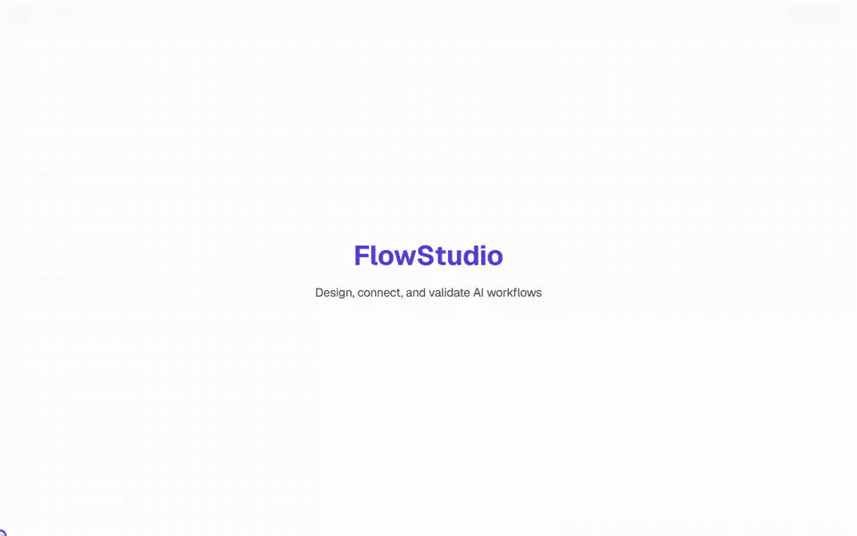
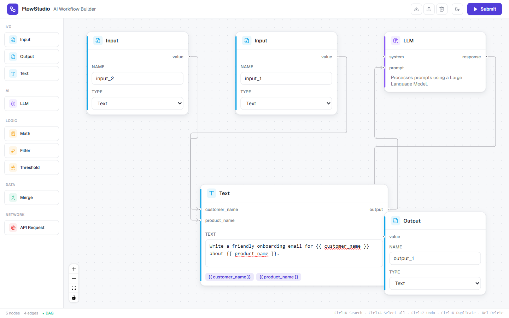
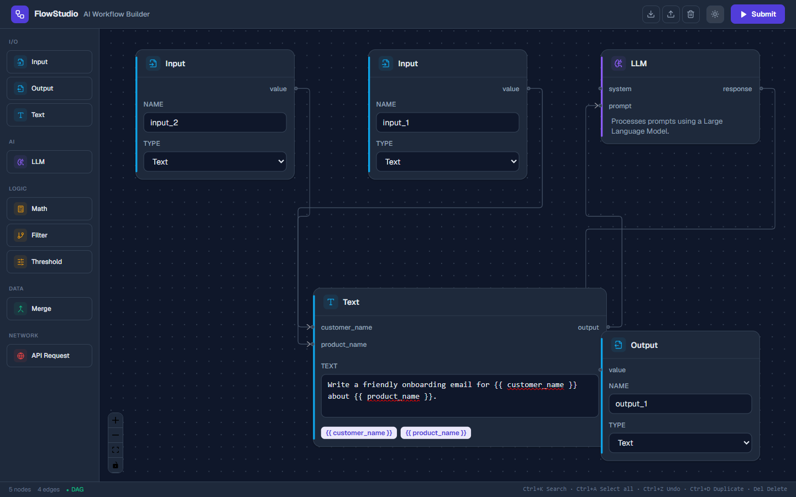
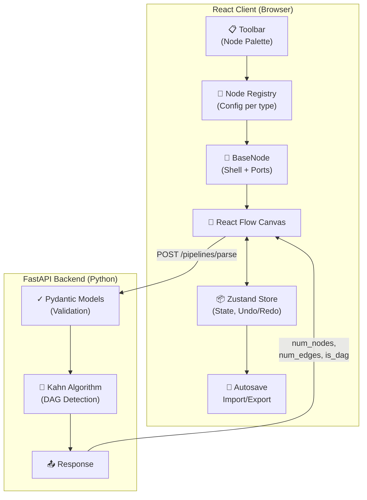

<div align="center">
  

  # FlowStudio

  **Visual workflow editor for building and validating AI pipelines.**

  [](https://react.dev/)
  [](https://vite.dev/)
  [](https://fastapi.tiangolo.com/)
  [](#testing)
  [](LICENSE)
</div>

<br />

<p align="center">
  
</p>

## About

FlowStudio is a drag-and-drop pipeline editor where you wire together typed nodes, create dynamic template variables, and validate the graph structure through a Python backend. The node system is config-driven, so adding a new node type is just a few lines of code.

<p align="center">
  
  
</p>

## Features

- **Config-driven nodes** - Shared rendering, fields, ports, colors, and defaults behind a single reusable abstraction
- **Dynamic text nodes** - `{{ variable_name }}` expressions auto-create input ports; removing a variable cleans up its edges
- **Graph-aware editing** - Cycle warnings, live DAG status, one-wire-per-input guardrails, collision-aware placement, minimap
- **Editor shortcuts** - Undo/redo, copy/paste, duplication, marquee selection, keyboard shortcuts, command search, import/export, autosave
- **Accessible UI** - Keyboard-operable node palette, focus-managed dialogs, semantic combobox/listbox behavior, visible focus states
- **Backend validation** - Typed Pydantic models, endpoint validation, node/edge counts, and Kahn's algorithm for DAG detection

## Architecture



### How the node system works

Every node type is declared in `frontend/src/nodes/registry.jsx`. The registry drives the toolbar, generates default data, and builds React Flow's `nodeTypes` map. Static nodes are pure config; specialized nodes (like Text or Merge) provide a custom body component while reusing the same shell and port system.

```jsx
{
  type: 'filter',
  title: 'Filter',
  category: 'logic',
  fields: [
    { name: 'condition', label: 'Condition', type: 'text' },
  ],
  handles: [
    { type: 'target', side: 'left', id: 'input', label: 'input' },
    { type: 'source', side: 'right', id: 'true', label: 'true' },
    { type: 'source', side: 'right', id: 'false', label: 'false' },
  ],
}
```

## Node Types

| Category | Nodes | What they do |
|----------|-------|--------------|
| I/O | Input, Output, Text | Pipeline boundaries and templated content |
| AI | LLM | Prompt + system inputs, model response output |
| Logic | Math, Filter, Threshold | Computation and conditional routing |
| Data | Merge | Dynamic fan-in with configurable input count |
| Network | API Request | HTTP requests with response/error paths |

## Getting Started

### Prerequisites

- Node.js 20+
- Python 3.10+

### 1. Start the backend

```bash
cd backend
python -m venv .venv

# Windows
.venv\Scripts\activate

# macOS / Linux
source .venv/bin/activate

pip install -r requirements.txt
uvicorn main:app --reload
```

### 2. Start the frontend

```bash
cd frontend
npm install
npm run dev
```

Open [http://localhost:3000](http://localhost:3000). The API runs on `http://localhost:8000` by default. Set `VITE_API_URL` to point to a different backend.

## API Reference

**`POST /pipelines/parse`**

Request:
```json
{
  "nodes": [{ "id": "input-1" }, { "id": "output-1" }],
  "edges": [{ "source": "input-1", "target": "output-1" }]
}
```

Response:
```json
{
  "num_nodes": 2,
  "num_edges": 1,
  "is_dag": true
}
```

Malformed payloads, duplicate node IDs, and dangling edge endpoints return `422` before graph analysis runs.

## Testing

```bash
# Frontend unit + component tests (54)
cd frontend && npm test

# End-to-end tests (Playwright)
npm run test:e2e

# Production build + audit
npm run build && npm audit

# Backend tests (20)
cd ../backend
pip install -r requirements-dev.txt
pytest -q
```

## Project Structure

```
.
├── backend/
│   ├── main.py                 # FastAPI app, models, DAG analysis
│   └── test_main.py            # API + graph tests
├── frontend/
│   ├── e2e/                    # Playwright browser tests
│   ├── src/
│   │   ├── components/         # Editor chrome (toolbar, dialogs, status)
│   │   ├── nodes/              # Node registry, shell, fields, custom bodies
│   │   ├── hooks/              # Keyboard shortcuts
│   │   ├── lib/graph.js        # Client-side DAG check
│   │   ├── store.js            # Zustand graph state + editor commands
│   │   └── ui.jsx              # React Flow canvas wrapper
│   └── vite.config.js
└── docs/assets/                # Screenshots and demo GIF
```

## Keyboard Shortcuts

| Shortcut | Action |
|----------|--------|
| `Ctrl/Cmd + K` | Command palette |
| `Ctrl/Cmd + A` | Select all |
| `Ctrl/Cmd + Z` | Undo |
| `Ctrl/Cmd + Shift + Z` / `Ctrl/Cmd + Y` | Redo |
| `Ctrl/Cmd + D` | Duplicate selection |
| `Ctrl/Cmd + C` / `Ctrl/Cmd + V` | Copy / Paste |
| `Delete` / `Backspace` | Delete selection |

## License

[MIT](LICENSE)
