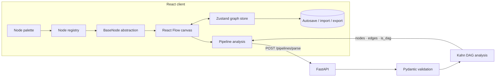

<div align="center">
  

  # FlowStudio

  **A fast, extensible visual editor for designing and validating AI workflows.**

  [](https://react.dev/)
  [](https://vite.dev/)
  [](https://fastapi.tiangolo.com/)
  [](#quality)
  [](LICENSE)
</div>

<p align="center">
  
</p>

## Why FlowStudio?

FlowStudio turns graph construction into a focused editing experience. Build a
pipeline from typed nodes, connect explicit input/output ports, create dynamic
template variables, and validate the graph through a FastAPI service—all while
keeping the node system small enough to extend through configuration.

<p align="center">
  
  
</p>

## Highlights

- **Config-driven node system** — shared rendering, fields, ports, colors, and
  defaults live behind one reusable abstraction.
- **Dynamic text nodes** — `{{ variable_name }}` expressions create stable input
  ports automatically; removed variables clean up their attached edges.
- **Graph-aware editing** — cycle warnings, live DAG status, one-wire-per-input
  guardrails, collision-aware placement, and a minimap for larger workflows.
- **Editor ergonomics** — undo/redo, copy/paste, duplication, marquee selection,
  keyboard shortcuts, command search, import/export, and local autosave.
- **Accessible interaction** — keyboard-operable node palette, focus-managed
  dialogs, semantic combobox/listbox behavior, and visible focus states.
- **Backend validation** — typed request models, endpoint validation, counts, and
  Kahn's-algorithm DAG analysis.

## Architecture



### Node abstraction

Every node is declared in `frontend/src/nodes/registry.jsx`. The registry feeds
the toolbar, initializes node data, and builds React Flow node components. Static
nodes are configuration only; specialized nodes can provide a custom body while
reusing the same shell and port system.

```jsx
{
  type: 'filter',
  title: 'Filter',
  category: 'logic',
  fields: [
    { name: 'condition', label: 'Condition', type: 'text' },
  ],
  handles: [
    { type: 'target', side: 'left', id: 'input', label: 'input' },
    { type: 'source', side: 'right', id: 'true', label: 'true' },
    { type: 'source', side: 'right', id: 'false', label: 'false' },
  ],
}
```

## Node catalog

| Category | Nodes | Purpose |
|---|---|---|
| I/O | Input, Output, Text | Pipeline boundaries and templated content |
| AI | LLM | Prompt/system inputs and model response output |
| Logic | Math, Filter, Threshold | Computation and conditional routing |
| Data | Merge | Dynamic fan-in with configurable input count |
| Network | API Request | Triggered HTTP request with response/error paths |

## Quick start

### Prerequisites

- Node.js 20+
- Python 3.10+

### 1. Start the API

```bash
cd backend
python -m venv .venv

# Windows
.venv\Scripts\activate

# macOS / Linux
source .venv/bin/activate

python -m pip install -r requirements.txt
python -m uvicorn main:app --reload
```

### 2. Start the editor

```bash
cd frontend
npm install
npm run dev
```

Open [http://localhost:3000](http://localhost:3000). The API runs on
`http://localhost:8000` by default. Set `VITE_API_URL` to target another API.

## API

`POST /pipelines/parse`

```json
{
  "nodes": [{ "id": "input-1" }, { "id": "output-1" }],
  "edges": [{ "source": "input-1", "target": "output-1" }]
}
```

```json
{
  "num_nodes": 2,
  "num_edges": 1,
  "is_dag": true
}
```

Malformed graph shapes, duplicate node IDs, and dangling edge endpoints return
HTTP `422` before graph analysis.

## Quality

```bash
# Frontend unit and component tests (54)
cd frontend && npm test

# Real-Chrome end-to-end tests (2)
npm run test:e2e

# Production build and dependency audit
npm run build
npm audit

# Backend tests (20)
cd ../backend
python -m pip install -r requirements-dev.txt
python -m pytest -q
```

The browser suite verifies dynamic handles, resizing, physical edge creation,
backend submission, focus restoration, rapid node placement, and malformed drag
recovery.

## Project structure

```text
.
├── backend/
│   ├── main.py                 # FastAPI models, validation, DAG analysis
│   └── test_main.py            # API and graph tests
├── frontend/
│   ├── e2e/                    # Playwright browser tests
│   ├── src/
│   │   ├── components/         # Editor UI and dialogs
│   │   ├── nodes/              # Node registry, shell, fields, custom bodies
│   │   ├── lib/graph.js        # Client-side DAG status
│   │   ├── store.js            # Graph state and editor commands
│   │   └── ui.jsx              # React Flow canvas
│   └── vite.config.js
└── docs/assets/                # README screenshots and demo
```

## Keyboard shortcuts

| Shortcut | Action |
|---|---|
| `Ctrl/Cmd + K` | Open node command palette |
| `Ctrl/Cmd + A` | Select all graph elements |
| `Ctrl/Cmd + Z` | Undo |
| `Ctrl/Cmd + Shift + Z` / `Ctrl/Cmd + Y` | Redo |
| `Ctrl/Cmd + D` | Duplicate selection |
| `Ctrl/Cmd + C` / `Ctrl/Cmd + V` | Copy / paste |
| `Delete` / `Backspace` | Delete selection |

## License

Released under the [MIT License](LICENSE).
