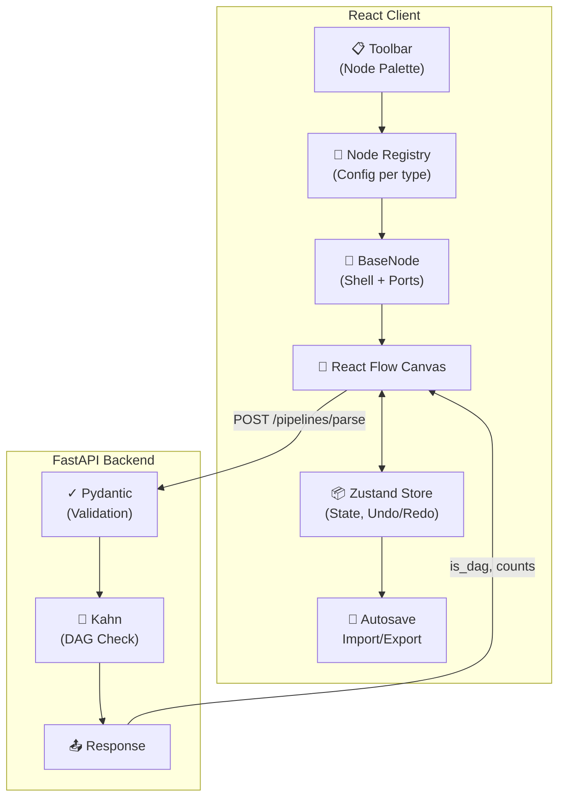

<div align="center">
  

  # FlowStudio

  **Visual workflow editor for AI pipelines. Drag, connect, validate.**

  [](https://react.dev/)
  [](https://vite.dev/)
  [](https://fastapi.tiangolo.com/)
  [](#testing)
  [](LICENSE)
</div>

<br />

<p align="center">
  
</p>

## What is FlowStudio?

A React + FastAPI pipeline builder where you visually wire typed nodes. Add nodes by dragging them onto the canvas, connect ports, define template variables with `{{ }}` syntax, and get instant validation feedback. The entire node system is config-driven—no JSX needed to add a new node type.

<p align="center">
  
  
</p>

## Why FlowStudio?

- **Zero boilerplate nodes** - Define a node in JSON; get rendering, ports, fields, validation for free
- **Template variables** - Type `{{ name }}` in text nodes and input ports generate automatically
- **Smart graph checks** - Cycle detection (Kahn's algorithm), DAG validation, one-wire-per-input
- **Polish** - Collision-aware placement, undo/redo, autosave, keyboard shortcuts, import/export
- **Accessible** - Full keyboard control, focus management, semantic combobox/listbox
- **Type-safe backend** - Pydantic models validate every request; schema mismatches fail fast

## Quick Start

### Prerequisites
- Node.js 20+
- Python 3.10+

### 1. Start backend
```bash
cd backend
python -m venv .venv
source .venv/bin/activate  # or .venv\Scripts\activate on Windows
pip install -r requirements.txt
uvicorn main:app --reload
```

### 2. Start frontend
```bash
cd frontend
npm install
npm run dev
```


## Architecture



## How Nodes Work

Each node is a config object in `frontend/src/nodes/registry.jsx`. The registry handles:
- Rendering the toolbar
- Building React Flow's `nodeTypes` map
- Seeding default field values

Static nodes are pure config. Complex nodes (Text, Merge) swap in a custom body component while reusing the shell.

```jsx
{
  type: 'filter',
  title: 'Filter',
  category: 'logic',
  fields: [
    { name: 'condition', label: 'Condition', type: 'text' },
  ],
  handles: [
    { type: 'target', side: 'left', id: 'input', label: 'input' },
    { type: 'source', side: 'right', id: 'true', label: 'true' },
    { type: 'source', side: 'right', id: 'false', label: 'false' },
  ],
}
```

## Node Catalog

| Type | Ports | Use |
|------|-------|-----|
| **Input** | 1 out | Pipeline entry point |
| **Output** | 1 in | Pipeline exit |
| **Text** | N in (dynamic), 1 out | Template variables + string output |
| **LLM** | 2 in (system, prompt), 1 out | LLM inference |
| **Math** | 1 in, 1 out | Add, subtract, multiply, divide |
| **Filter** | 1 in, 2 out (true/false) | Conditional routing |
| **API Request** | 2 in, 2 out (response/error) | HTTP calls |
| **Merge** | N in (configurable), 1 out | Fan-in combiner |
| **Threshold** | 1 in, 2 out (above/below) | Value comparison |

## API

**`POST /pipelines/parse`**

```json
{
  "nodes": [{ "id": "input-1" }, { "id": "output-1" }],
  "edges": [{ "source": "input-1", "target": "output-1" }]
}
```

Response:
```json
{
  "num_nodes": 2,
  "num_edges": 1,
  "is_dag": true
}
```

Returns `422` for malformed payloads, duplicate node IDs, or dangling edges.

## Testing

```bash
# Frontend (54 unit + component tests)
cd frontend && npm test

# E2E (Playwright)
npm run test:e2e

# Backend (20 tests)
cd backend && pip install -r requirements-dev.txt && pytest -q

# Build + audit
npm run build && npm audit
```

## Project Layout

```
.
├── backend/
│   ├── main.py          # FastAPI + Pydantic + Kahn's algorithm
│   └── test_main.py     # API + graph validation tests
├── frontend/
│   ├── e2e/             # Playwright tests
│   ├── src/
│   │   ├── nodes/       # Registry, BaseNode, field renderers
│   │   ├── store.js     # Zustand graph state
│   │   ├── ui.jsx       # React Flow canvas
│   │   ├── hooks/       # Keyboard shortcuts
│   │   └── components/  # Toolbar, dialogs, status bar
│   └── vite.config.js
└── docs/assets/         # Screenshots
```

## Keyboard Shortcuts

| Key | Action |
|-----|--------|
| `Ctrl/Cmd + K` | Command palette |
| `Ctrl/Cmd + A` | Select all |
| `Ctrl/Cmd + Z` / `Y` | Undo / Redo |
| `Ctrl/Cmd + D` | Duplicate |
| `Ctrl/Cmd + C` / `V` | Copy / Paste |
| `Delete` | Remove selected |

## License

MIT
